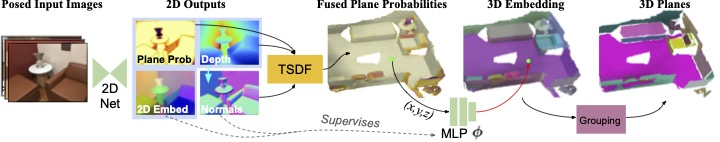

# AirPlanes: Accurate Plane Estimation via 3D-Consistent Embeddings

This is the reference PyTorch implementation for training and testing AirPlanes, the method described in the following CVPR 2024 publication:
> **AirPlanes: Accurate Plane Estimation via 3D-Consistent Embeddings**

> [Jamie Watson](https://scholar.google.com/citations?view_op=list_works&hl=en&user=5pC7fw8AAAAJ), [Filippo Aleotti](https://filippoaleotti.github.io/website/), [Mohamed Sayed](https://masayed.com/), [Zawar Qureshi](https://qureshizawar.github.io/), [Oisin Mac Aodha](https://www.homepages.inf.ed.ac.uk/omacaod), [Gabriel Brostow](http://www0.cs.ucl.ac.uk/staff/g.brostow/), [Michael Firman](http://www.michaelfirman.co.uk/), and [Sara Vicente](https://scholar.google.co.uk/citations?user=7wWsNNcAAAAJ&hl=en)

> [Project Page](https://nianticlabs.github.io/airplanes/), [Paper (pdf)](https://nianticlabs.github.io/airplanes/resources/airplanes_cvpr2024.pdf), [Supplementary Material (pdf)](https://nianticlabs.github.io/airplanes/resources/airplanes_cvpr2024_supp.pdf), [Video](https://www.youtube.com/watch?v=HnGAORJ8JEI)


<p align="center">
  
</p>


This code is for non-commercial use only; please see the license file for terms. If you do find any part of this codebase helpful, please cite our paper using the BibTex below. Thanks!

## Table of Contents

  * [🗺️ Overview](#🗺️-overview)
  * [⚙️ Setup](#⚙️-setup)
  * [📦 Pretrained models](#📦-pretrained-models)
  * [🏃 Running out of the box!](#🏃-running-out-of-the-box)
  * [🗃️ Data preparation](#🗃️-data-preparation)
  * [🧪 Running and Evaluating on ScanNetV2](#🧪-running-and-evaluating-on-scannetv2)
  * [⏳ Optional: Training the 2D Network on ScanNetV2](#⏳-optional-training-the-2d-network-on-scannetv2)
  * [🙏 Acknowledgements](#🙏-acknowledgements)
  * [📜 BibTeX](#📜-bibtex)
  * [👩‍⚖️ License](#👩‍⚖️-license)

## 🗺️ Overview

AirPlanes takes as input posed RGB images, and outputs a 3D planar representation of the scene.

### Pipeline overview
Our pipeline consists of the following steps:
- **2D Network inference**, where the network predicts for each image:
  * A *depth map*.
  * A per-pixel *planar probability score*, indicating if a pixel is part of a planar or of a non-planar region.
  * A per-pixel *planar embedding*, where pixels belonging to the same plane should have a similar embedding vector.

  This network extends [SimpleRecon](https://nianticlabs.github.io/simplerecon/), a popular network for depth estimation from posed images. 
- **Scene Optimisation**, where a scene-specific MLP is trained for each scene. This step tackles the main limitation of the previous step: planar embeddings predicted from single images are not multi-view consistent.
The MLP takes as input the coordinates of a 3D point (x,y,z) and predicts an embedding vector. A `push-pull` loss enforces that embeddings that are similar/different in an image must also be similar/different in 3D. After training, each per-scene MLP can predict a multi-view consistent embedding array for any 3D point in the scene.
- **3D Plane Clustering**, where a clustering algorithm is used to group mesh vertices into planes. Our custom sequential RANSAC implementation uses the 3D embeddings from the MLP to identify the inilier set of each 3D plane hypothesis. 


## ⚙️ Setup

You can install a new environment using mamba. To install mamba:

```shell
make install-mamba
```

To create the environment:
```shell
make create-mamba-env
```

Next, please activate the environment and install the project as a module:
```shell
conda activate airplanes
pip install -e .
```

We ran our experiments with PyTorch 2.0.1, CUDA 11.7 and Python 3.9.7.


## 📦 Pretrained models
Our 2D network pretrained on ScanNetv2 is available [online here](https://storage.googleapis.com/niantic-lon-static/research/airplanes/airplanes_model.ckpt).

We suggest you place the downloaded model in a new `checkpoints` folder.

## 🏃 Running out of the box!

We made two captures available to make it easier to quickly try the code.

First, [download these scans](https://storage.googleapis.com/niantic-lon-static/research/airplanes/vdr.zip), place them in a new folder called `arbitrary_captures` and unzip them.

Then, run the full inference pipeline with our model:
```shell
echo "📸 Preparing keyframes for the sequences"
python -m scripts.inference_on_captures prepare-captures [--captures /path/to/captures]

echo "🚀 Generating TSDFs and 2D embeddings using our model for each scan"
python -m scripts.inference_on_captures model-inference [--checkpoint /path/to/model/checkpoint --output-dir  /path/to/predicted/meshes]

echo "🚀 Training 3D embeddings (MLPs)..."
python -m scripts.inference_on_captures train-embeddings [--pred-root  /path/to/predicted/meshes --captures /path/to/captures]

echo "🚀 Running RANSAC!"
python -m scripts.inference_on_captures run-ransac-ours [--pred-root  /path/to/predicted/meshes --dest-planar-meshes /path/to/planar/meshes --captures /path/to/captures]
```

This script will infer per-image embeddings and scene geometry using the 2D network, optimise 3D embeddings and, finally, fit planar meshes using 3D embeddings in the RANSAC loop.


## 🗃️ Data preparation
This section explains how to prepare ScanNetv2 for training and testing: in fact, ScanNetv2 only provides meshes with semantic labels, but not with planes.
Following previous works, we process the dataset extracting planar information with RANSAC.

🕒 Please note that the data preparation scripts will take a few hours to run.

<details>
<summary>ScanNetv2 download (training & testing)</summary>

  Please follow instructions reported in [SimpleRecon](https://github.com/nianticlabs/simplerecon/tree/main/data_scripts/scannet_wrangling_scripts)

You should get at the end a ScanNetv2 root folder that looks like:
```shell
SCANNET_ROOT
├── scans_test (test scans)
│   ├── scene0707
│   │   ├── scene0707_00_vh_clean_2.ply (gt mesh)
│   │   ├── sensor_data
│   │   │   ├── frame-000261.pose.txt
│   │   │   ├── frame-000261.color.jpg 
│   │   │   └── frame-000261.depth.png (full res depth, stored scale *1000)
│   │   ├── scene0707.txt (scan metadata and image sizes)
│   │   └── intrinsic
│   │       ├── intrinsic_depth.txt
│   │       └── intrinsic_color.txt
│   └── ...
└── scans (val and train scans)
    ├── scene0000_00
    │   └── (see above)
    ├── scene0000_01
    └── ....
```
</details>

<details>
<summary>Ground-truth generation from ScanNetv2 meshes (training & testing)</summary>
  
  Our ground-truth generation script is adapted from the one released by [PlaneRCNN](https://github.com/NVlabs/planercnn/blob/master/data_prep/parse.py).

Run:
```shell
python -m scripts.run_scannet_processing --scannet path/to/ScanNetv2 --output-dir destination/path
```

*NOTE:* PlaneRCNN saves planes as `(nx*d,ny*d,nz*d)`, while our project represents planes as `(nx/d,ny/d,nz/d)`.
We will manage this difference later in our dataloaders.

The code will generate in the root folder a structure as:

```
ROOT_FOLDER
├── scene0000_00
│   ├── planes.npy  (array with planes parameters. Each plane is encoded as (nx*d,ny*d,nz*d))
│   └── planes.ply  (unsquashed mesh of the scene, where each colour encodes a plane ID)
├── scene0000_01
│   └── annotation
│       ├── planes.npy
│       └── planes.ply
└── ...
```

Unsquashed means that the geometry of the mesh is unchanged with respect to the ground truth mesh provided by ScanNetv2, i.e. the mesh is not composed of planes. The colour of each vertex in the mesh encodes the plane ID.

RGB channels encode the plane ids, which can be obtained using:
```python
    plane_ids = plane_mesh.visual.vertex_colors.copy().astype("int32")
    plane_ids = (
        plane_ids[:, 0] * 256 * 256 + plane_ids[:, 1] * 256 + plane_ids[:, 2]
    ) // 100 - 1
```

The alpha channel stores `0` if the vertex is an edge between two planes.
</details>

<details>
<summary>Render ground truth plane images (training & testing)</summary>

  At this point, we have RGB images, depth maps and plane-annotated ground-truth meshes. We are missing images annotated with plane IDs.
  To get those images, we have to render ground-truth meshes at different camera locations.

```shell
python -m scripts.run_rendering render-train-split --scannet /path/to/scannet --planar-meshes /path/to/mesh/with/planes/ids --output-dir /path/to/render/folder

python -m scripts.run_rendering render-val-split --scannet /path/to/scannet --planar-meshes /path/to/mesh/with/planes/ids --output-dir /path/to/render/folder

python -m scripts.run_rendering render-test-split --scannet /path/to/scannet --planar-meshes /path/to/mesh/with/planes/ids --output-dir /path/to/render/folder
```

The script generates in the `DEST` folder a structure as:
```shell
DEST
├── scene0000_00
│   └── frames
│       ├── 000000_planes.png   (image where pixels encode planeIDs)
│       ├── 000000_depth.npy    (depth map rendered from the mesh)
│       ├── 000001_planes.png
│       ├── 000001_depth.png
│       └── ...
├── scene0000_01
│   └── frames
│       ├── 000000_planes.png
│       ├── 000000_depth.npy
│       ├── 000001_planes.png
│       ├── 000001_depth.npy
│       └── ...
└── ...   
```

As before, we can get plane Ids from colours in `planes.png` as:

```python
plane_ids = your_custom_image_reader("000000_planes.png")
plane_ids = (plane_ids[:, :, 0] * 256 * 256 + plane_ids[:, :, 1] * 256 + plane_ids[:, :, 2]) // 100 - 1
```

Note that rendered depth maps are not needed for training and validation. For this reason, we do not save depth maps for these two splits.
</details>

<details>
<summary>Generate visibility volumes (testing)</summary>

  We rely on visibility volumes for benchmarking. This is because the ground-truth mesh in ScanNetv2 has been obtained by post-processing sensor data. This mask allows to remove voxels that are not visible in the scan. Please see more details in the paper and supplement.

The following script can generate such volumes using depth renders and ScanNetv2 data.

```shell
python -m scripts.run_creation_of_visibility_volumes --scannet /path/to/scannet --output-dir /path/to/planar/meshes --renders /path/to/render/folder
```

Where `--renders` points to the directory with the ground truth plane images created in the previous step.
The script adds the visibility volumes to `output-dir`, so that the final structure is:

```shell
├── scenexxxx_yy
│   ├── mesh_with_planes.ply
│   ├── scenexxxx_yy_planes.npy
│   ├── scenexxxx_yy_visibility_pcd.ply (a point cloud for debugging purposes only)
│   ├── scenexxxx_yy_volume.npz (visibility volume!)
└── ...  
```
**NOTE:** our benchmarks expect to find volumes in the same folder of ground-truth meshes with planes. Please set `output-dir` accordingly.

At the end of the process you can inspect the sampled visibility volume, saved as a point cloud. It should look like the following figure:

<p align="center">
  
</p>

</details>


## 🧪 Running and Evaluating on ScanNetV2

🚦 __We need ground-truth meshes with planes and visibility volumes. Please run all the data preparation steps if you haven't already. 🙏__

In order to evaluate AirPlanes, first we have to run the inference of our 2D network and cache intermediate results. Then, we use these outputs to train our 3D embeddings MLPs, one per scene. This embeddings can be used in the RANSAC loop to extract a planar representation for the scene (saved as a planar mesh, one per scene). Once we have all the planar meshes we can evaluate them using our meshing, segmentation and planar benchmarks.

First, we have to update the testing configuration `configs/data/scannet_test.yaml`. Specifically:
- `dataset_path`: path to ScanNetv2 data

The following script summarises all the steps. You can run (and customise) these steps individually if needed.

```shell
echo "🚀 Generating TSDFs and 2D embeddings using our model for each scan"
python -m scripts.evaluation model-inference [--output-dir /path/to/results/folder]

echo "🚀 Training 3D embeddings (MLPs)..."
python -m scripts.evaluation train-embeddings [--pred-root /path/to/predicted/meshes]

echo "🚀 Running RANSAC!"
python -m scripts.evaluation run-ransac-ours [--pred-root /path/to/predicted/meshes --dest-planar-meshes /path/to/planar/meshes]

echo "🧪 Benchmarking Geometry"
python -m scripts.evaluation meshing-benchmark [--pred-root /path/to/planar/meshes --gt-root /path/to/ground/truth --output-score-dir /path/to/scores/folder]

echo "🧪 Benchmarking Segmentation"
python -m scripts.evaluation segmentation-benchmark [--pred-root /path/to/planar/meshes --gt-root /path/to/ground/truth --output-score-dir /path/to/scores/folder]

echo "🧪 Benchmarking Planar"
python -m scripts.evaluation planar-benchmark [--pred-root /path/to/planar/meshes --gt-root /path/to/ground/truth --output-score-dir /path/to/scores/folder]
```

Similarly, you can evaluate the baseline model, i.e. SimpleRecon without embeddings. You can use the meshes saved by our model. The baseline doesn't need per-scene optimisation ⏩.

```shell
echo "🚀 Running RANSAC!"
python -m scripts.evaluation run-ransac-baseline [--pred-root /path/to/predicted/meshes --dest-planar-meshes /path/to/planar/meshes]

echo "🧪 Benchmarking Geometry"
python -m scripts.evaluation meshing-benchmark [--pred-root /path/to/planar/meshes --gt-root /path/to/ground/truth]
...
```

## ⏳ Optional: Training the 2D Network on ScanNetV2

**We recommend using our pretrained 2D network when evaluating our method.**

To retrain the 2D network, please first [download the initial weights from here](https://storage.googleapis.com/niantic-lon-static/research/airplanes/simplerecon_starting_weights.ckpt) and place it in the "checkpoints" folder. You also need to generate the training data, following the instructions in [data preparation](#🗃️-data-preparation).

This network is in charge of estimating depth maps, 2D plane embeddings and per-pixel plane probabilities from posed images.

First, we have to update the training configuration `configs/data/scannet_train.yaml`. Specifically:
- `dataset_path`: path to ScanNetv2 data
- `planes_path`: path to meshes with planes IDs generated during the step `Ground-truth generation from ScanNetv2 meshes`
- `renders_path`: path to the training renders generated during the step `Render ground truth plane images (training & testing)`

When the config is ready, please run:
```shell
python -m airplanes.train_2D_network
```


## 🙏 Acknowledgements

We thank PlaneRCNN authors for sharing their data processing code.

## 📜 BibTeX
If you find our work useful in your research, please consider citing our paper:

```
@inproceedings{watson2024airplanes,
  title={AirPlanes: Accurate Plane Estimation via 3D-Consistent Embeddings},
  author={Watson, Jamie and Aleotti, Filippo and Sayed, Mohamed and Qureshi, Zawar and Brostow and Mac Aodha, Oisin and Firman, Michael and Vicente, Sara},
  booktitle={Proceedings of the IEEE/CVF Conference on Computer Vision and Pattern Recognition (CVPR)},
  year={2024},
}
```

## 👩‍⚖️ License
Copyright © Niantic, Inc. 2024. Patent Pending.
All rights reserved.
Please see the [license file](LICENSE) for terms.